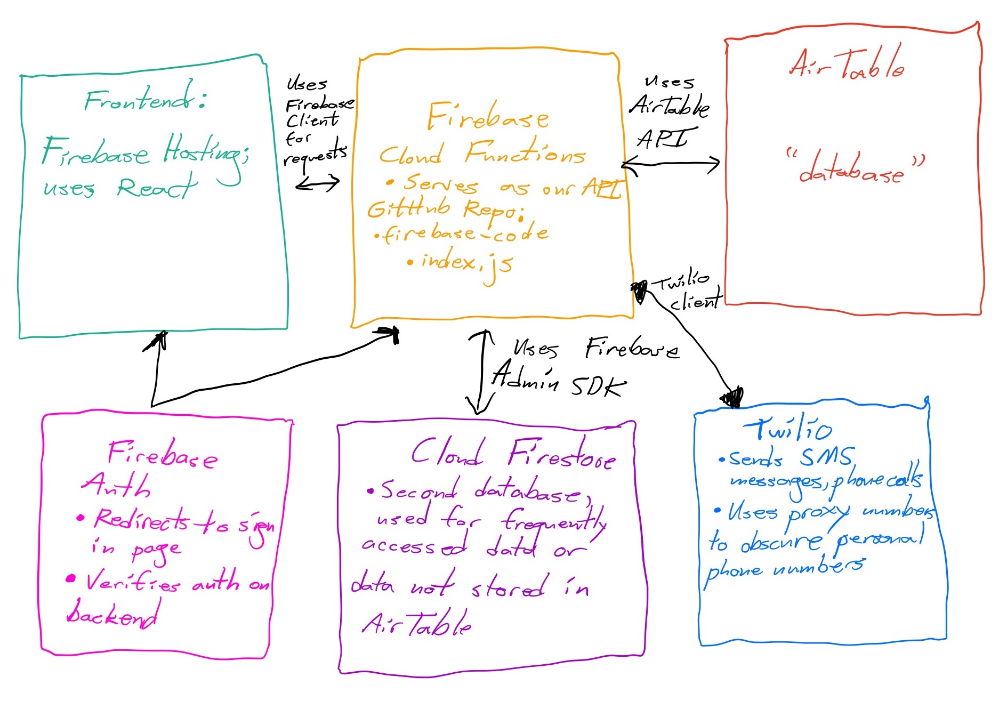

## Codebase Overview
The following image depicts the overall structure of the Step Up codebase:
 

AirTable serves as the master database for tutor, student, and other information.

In order to link the data in AirTable to the portal frontend, Firebase Authentication and Cloud Functions are used for authentication and server-side code to make requests to AirTabel, respectively. 

Although AirTable does have an API, it is rate-limited to 5 requests per second, so in the case of potentially high-volume usage (such as the SMS messaging system), we set up a system to copy some of the most relevant information from AirTable to Firebase Cloud Firestore, which serves as our primary user database, storing information about the tutors and students. 

The SMS system uses Twilio phone numbers as proxies to connect the tutors with their student’s guardian. We have 5 proxy numbers, and we have a routing system that uses the information in Firestore to deliver messages and calls to the right people.

## Dev Environment Setup
### Firebase CLI
The bulk of the setup will be getting the Firebase emulators running. The first step will be to install the Firebase CLI; instructions for doing this can be found [here](https://firebase.google.com/docs/cli#install-cli-mac-linux), but for macOS or Linux users you can do this by running the following command:
```
curl -sL https://firebase.tools | bash
```

In addition to installing the CLI, you will need to login to Firebase from the CLI so it can connect to the project. For this to work, the Google account you intend to use with Firebase must be added as a user in the Firebase admin console - if it has not yet been added, please talk to [Caleb Hester](mailto:caleb@stepuptutoring.org). 

If your account is added in Firebase, simply login via:
```
firebase login
```
Make sure to log in with the same Google account that was used for Firebase.

### Additional Dependencies
In addition to the Firebase CLI, you will need to make sure Java is installed on your computer, and that you have NodeJS and npm installed.

### Starting the emulators
Clone this repository, then `cd` into the `firebase-code` folder. From here, run:
```
npm install
```
This installs the dependencies for the startup script, but there are also separate dependencies for Cloud functions.
To install these, `cd` into the `functions` folder, then run:
```
npm install
```

You will also have to get the configuration file for Cloud Functions; to do this, run:
```
firebase functions:config:get > .runtimeconfig.json
```
in the `functions` folder. 

Once this is done, run:
```
cd ..
./startup
```
This will start the Firebase emulators and begin watching the JS files in the `src` folder, so any changes you make to the frontend or backend code should be immediately reflected.

### Viewing the App
Before you can view the onboarding portal, you will have to visit [http://localhost:5001/stepup-dashboard/us-central1/syncPeopleDataTest](http://localhost:5001/stepup-dashboard/us-central1/syncPeopleDataTest) in your browser. This will add relevant tutor and student information to the Firestore emulator and allow the dashboard to load successfully. **Skipping this step will prevent the dashboard from loading and will cause a 403 error**.

To view the onboarding dashboard in your browser, go to [http://localhost:5000/onboarding_dashboard.html](http://localhost:5000/onboarding_dashboard.html). 

To view the tutor dashboard in your browser, go to [http://localhost:5000/tutor_portal.html](http://localhost:5000/tutor_portal.html).
